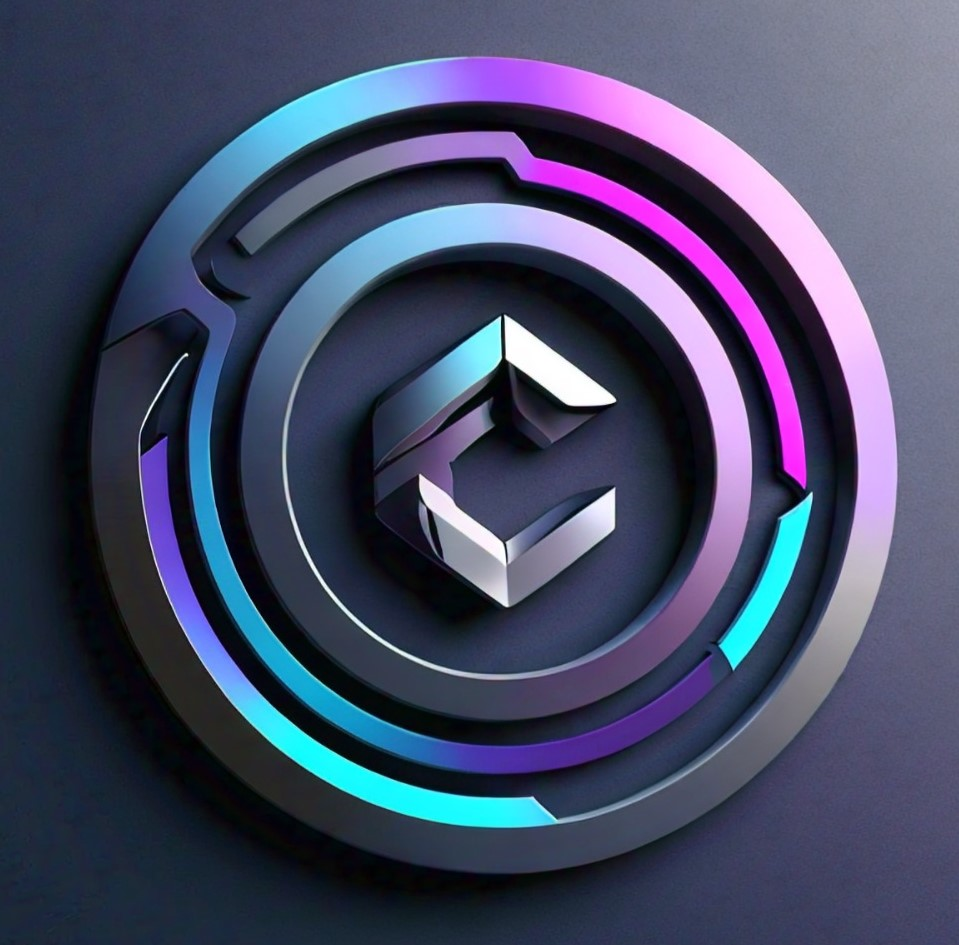

# CryptoConnect

CryptoConnect is a React-based web application that allows users to connect their cryptocurrency wallets and view their token balances. The application supports both Ethereum and Solana wallets.

## Features

- Connect to Ethereum and Solana wallets
- View token balances for connected wallets
- User-friendly interface with TailwindCSS and DaisyUI

## Deployment
The application can be easily deployed on Vercel.

## Usage
- Open the application in your browser.
- Click the “Connect Wallet” button.
- Choose your preferred wallet (Ethereum or Solana).
- View your token balances.

## Technologies Used
- React
- Web3.js
- TailwindCSS
- DaisyUI